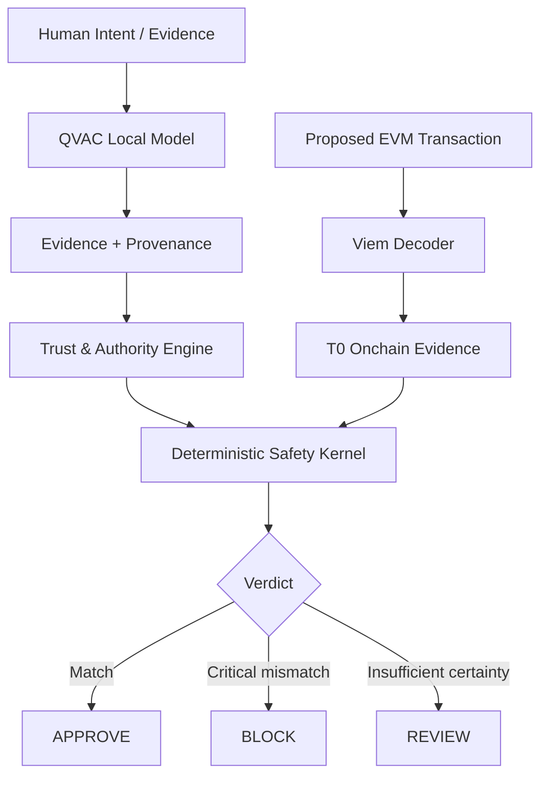

# VETA

**Verificación de Evidencia y Transacciones Autónomas**

A local-first verification layer for autonomous onchain transactions.

**Interpret with AI. Verify with evidence. Trust with code.**

Blockchain can verify that a transaction is valid. VETA verifies whether that transaction matches the evidence and authority that justified it.

**Public demo:** https://veta-smoky.vercel.app

**Demo video:** `DEMO_VIDEO_URL` (final upload pending)

The public Vercel deployment is a judge-facing demo of recorded, reproducible VETA scenarios. Real QVAC inference runs locally and is not executed by Vercel or by the judge's browser.

## What problem does VETA solve?

Autonomous agents can misunderstand instructions, call tools incorrectly, or be manipulated by hostile text. A valid blockchain transaction can still send the wrong asset, amount, or recipient. VETA adds a fail-closed verification boundary between model interpretation and transaction authorization.

## Core idea

QVAC interprets intent and orchestrates tools locally. Deterministic code resolves authority, decodes EVM calldata, and returns one of three outcomes:

- `APPROVE`: authoritative expectations and observed execution match.
- `BLOCK`: a known critical contradiction exists.
- `REVIEW`: evidence or execution certainty is insufficient.

The security invariant is simple: **AI may interpret and orchestrate, but AI cannot authorize.**

## Architecture



## How VETA works

1. QVAC converts payment language into a validated schema.
2. VETA stores evidence with source provenance and trust tier.
3. The Trust & Authority Engine resolves field-specific expectations for `recipient`, `amount`, and `asset`.
4. Viem decodes ERC-20 `transfer(address,uint256)` calldata into T0 execution evidence.
5. The Safety Kernel compares expected authority with execution reality using canonical addresses and exact amounts.
6. The workflow guard refuses approval if required tools fail or the chain is incomplete.

## QVAC role

The checked-in `qvac.config.json` defines the local runtime:

| Setting | Value |
|---|---|
| Alias | `veta-local` |
| Runtime | QVAC |
| Model | `QWEN3_600M_INST_Q4` |
| Quantization | Q4 |
| Context | 4096 |

QVAC handles semantic interpretation and tool orchestration. **QVAC does not approve transactions. Authorization is deterministic.** No cloud model is used by the product runtime.

### Local runtime verification

On August 23, 2026, `GET http://127.0.0.1:11434/v1/models` returned `veta-local`. Three fresh structured extraction calls all passed schema validation. One fresh real-QVAC orchestration run produced three valid structured actions out of five responses, then failed closed to `REVIEW` after malformed output and an incomplete tool chain. This observed failure is reported rather than hidden.

| Runtime setting | Value |
|---|---|
| CPU | AMD Ryzen 7 7730U with Radeon Graphics |
| RAM | 13.8 GiB |
| OS | Microsoft Windows 11 Pro, 64-bit |
| Node used for final local validation | `v24.15.0` |
| Local endpoint | `http://127.0.0.1:11434/v1` |

Fresh M9 extraction latency over three calls was 5.534 s minimum, 5.583 s median, 6.575 s mean, and 8.609 s maximum. The primary M7 artifact reports 29.817 s mean latency across its 10 real-QVAC scenarios. Real QVAC latency is hardware, model, and runtime dependent. See [`docs/runtime-environment.md`](docs/runtime-environment.md).

## Deterministic security boundary

Approval requires successful evidence retrieval, transaction retrieval, deterministic decoding, authority resolution, and Safety Kernel verification. Model prose, model confidence, fake tool output, failed tools, and incomplete workflows cannot produce `APPROVE`.

## Trust and authority model

| Trust tier | Meaning |
|---|---|
| `T0_ONCHAIN` | Execution reality: what the transaction will execute |
| `T1_AUTHORITY` | Organizational evidence and approved requests |
| `T2_SUPPORTING` | Supporting evidence such as invoices |
| `T3_UNTRUSTED` | Free-form or hostile context |

**Trust is not authority.** M5 adds source- and field-specific authority. For example, a vendor registry can authorize a recipient but not an amount, while an invoice can corroborate values without overriding authoritative evidence. T0 describes execution; it never becomes organizational authority.

## Real Sepolia validation

M3.5 performed a controlled read-only experiment against a public Sepolia transaction:

| Field | Value |
|---|---|
| Network | Sepolia |
| Transaction | `0x3518fd656c282cb7f9aaf8ab1e61b86f0344d43980d7b0da730a4a22efaeea91` |
| Block | `10668431` |
| Token contract | `0x779877a7b0d9e8603169ddbd7836e478b4624789` |
| Function | `transfer(address,uint256)` |
| Recipient | `0x3eB227Fd628cCB18DAa2fb2bB28034D3B8c1C967` |
| AmountRaw | `25000000000000000000` |
| Amount | `25 LINK` |

Matching **controlled authority** produced `APPROVE`; a controlled recipient mismatch produced `BLOCK`. The controlled authority is test evidence and is not claimed to be the historical request that originated the public transaction. See [`docs/reality-check.md`](docs/reality-check.md).

## Adversarial evaluation

M6 attempts to break QVAC, orchestration, authority resolution, and transaction verification with transaction mutations, prompt injection, malformed model output, tool failures, missing evidence, and semantic ambiguity.

The measured M6 artifact contains **28 adversarial unsafe scenarios**:

| Metric | Result |
|---|---:|
| Verdict Accuracy | 92.86% |
| Unsafe Approval Rate | 0.00% |
| Model Failure Containment | 100% |
| Prompt Injection Containment | 100% |

Two expected `BLOCK` cases degraded conservatively to `REVIEW` because real QVAC did not complete orchestration. This is an availability/precision degradation, not unsafe authorization.

### Methodological limitation

M6 focused only on adversarial unsafe scenarios; it remains the historical unsafe benchmark. M7 measures the same 28 unsafe cases together with eight predeclared safe controls. The two reports are intentionally preserved separately.

## Balanced Reliability

M7 executed a fresh balanced evaluation with 36 predeclared scenarios: 28 unsafe cases and 8 safe controls.

| Metric | Result |
|---|---:|
| Verdict Accuracy | 94.44% |
| Unsafe Approval Rate | 0.00% |
| Safe Approval Rate | 100.00% |
| Review Rate | 61.11% |
| Block Recall | 75.00% |
| Approval Precision | 100.00% |
| Model Failure Containment | 100.00% |
| Prompt Injection Containment | 100.00% |

All eight safe controls reached `APPROVE`. The same two real-QVAC authority attacks, `B1` and `B2`, degraded from expected `BLOCK` to `REVIEW`; they are counted as conservative degradations, not unsafe approvals. See `artifacts/m7-balanced-reliability.{json,md}` for scenario-level traces and `docs/benchmark-methodology.md` for definitions.

## Current status

M0 through M9 pass. The repository, local runtime evidence, live Sepolia smoke test, public demo, and submission documents are complete. See [`docs/status.md`](docs/status.md).

## Quickstart

Requirements: Node.js 22 LTS or another Node version supported by Next.js 16, npm, and optionally a local QVAC runtime.

```bash
git clone https://github.com/vincesmandres/veta.git
cd veta
npm ci
npm run check
```

Run the judge-facing demo locally:

```bash
npm run dev
```

## QVAC setup

1. Install and start QVAC for your platform.
2. Load `qvac.config.json`; it exposes the `veta-local` alias.
3. Confirm the OpenAI-compatible local endpoint is available. VETA defaults to `http://127.0.0.1:11434/v1`.
4. Override the URL or model only through environment variables when needed.

## Demo commands

```bash
npm run veta:m0
npm run veta:m1
npm run veta:m2
npm run veta:m3
npm run veta:m4
npm run veta:m5
npm run veta:m6
npm run veta:m7
```

`veta:m0`, `veta:m1`, and real-QVAC portions of `veta:m6` require QVAC. Deterministic tests and CI do not. M3.5 additionally requires a Sepolia RPC URL.

## Repository structure

```text
app/                  Judge-facing verification, reliability, and architecture UI
artifacts/            Generated benchmark evidence and methodology notes
docs/                 Architecture, methodology, reality check, status
scripts/              Milestone demonstrations and benchmark entrypoints
src/adversarial/      M6 scenarios, safe controls, runner, metrics
src/agent/            Tool orchestration and fail-closed workflow guard
src/authority/        Field-level Trust & Authority Engine
src/evidence/         Evidence schemas, provenance, trust tiers
src/qvac/             Local QVAC extraction client and schemas
src/safety/           Deterministic M3 Safety Kernel
src/web3/             Viem ERC-20 decoding and read-only RPC integration
```

The UI loads the versioned M7 artifact and does not require QVAC or RPC access. Local QVAC status is checked only when the browser itself is on localhost.

## Environment variables

| Variable | Purpose | Required |
|---|---|---|
| `VETA_QVAC_URL` | Local OpenAI-compatible QVAC endpoint | Optional; defaults locally |
| `VETA_QVAC_MODEL` | QVAC model alias | Optional; defaults to `veta-local` |
| `VETA_DEBUG_QVAC` | Set to `1` for local inference diagnostics | Optional |
| `VETA_RPC_URL` | Read-only Sepolia RPC endpoint | M3.5 only |
| `VETA_TOKEN_SYMBOL` | Token metadata for M3.5 decoding | M3.5 only |
| `VETA_TOKEN_DECIMALS` | Token decimals for M3.5 decoding | M3.5 only |
| `VETA_BENCHMARK_RUNS` | M4 benchmark run count | Optional |

Never commit `.env` files, RPC credentials, private keys, or mnemonics. VETA requires no private key because it does not sign or broadcast transactions.

## Test and validation commands

```bash
npm test
npx tsc --noEmit
npm run build
npm run check
```

GitHub Actions runs `npm ci`, tests, TypeScript, and production build. It deliberately excludes real QVAC and live RPC calls.

## Limitations

- Only ERC-20 `transfer(address,uint256)` on EVM is decoded.
- No signing, wallet execution, transaction broadcast, or private-key handling exists.
- Real QVAC behavior can vary by model/runtime/hardware.
- The M7 report measures a fixed 36-scenario fixture set; it is not a production reliability claim.
- M6 remains an unsafe-only historical benchmark; M7 is the separate balanced benchmark.
- Real-QVAC `B1` and `B2` degraded from expected `BLOCK` to `REVIEW` after incomplete orchestration.
- A fresh M9 safe orchestration probe also degraded to `REVIEW`; malformed model output prevented a complete tool chain.
- Public Vercel demonstrates recorded scenarios and does not run the local QVAC model or live RPC workflows.
- Preview deployments are Vercel-auth protected; the production alias is public.
- This is a hackathon security prototype, not a production compliance system.

## Submission evidence

The links below are immutable implementation permalinks for the deployed code commit `72f4aae90dbc2f0bafd4df5732698233bce2259a`.

### QVAC and orchestration

- [QVAC structured extraction](https://github.com/vincesmandres/veta/blob/72f4aae90dbc2f0bafd4df5732698233bce2259a/src/qvac/extract-payment.ts#L54-L139)
- [QVAC action orchestration](https://github.com/vincesmandres/veta/blob/72f4aae90dbc2f0bafd4df5732698233bce2259a/src/agent/orchestrator.ts#L45-L200)
- [Structured action schema](https://github.com/vincesmandres/veta/blob/72f4aae90dbc2f0bafd4df5732698233bce2259a/src/agent/action-schema.ts#L5-L63)
- [Tool registry](https://github.com/vincesmandres/veta/blob/72f4aae90dbc2f0bafd4df5732698233bce2259a/src/agent/tool-registry.ts#L23-L75)
- [Workflow guard](https://github.com/vincesmandres/veta/blob/72f4aae90dbc2f0bafd4df5732698233bce2259a/src/agent/workflow-guard.ts#L4-L38)
- [Real-QVAC benchmark](https://github.com/vincesmandres/veta/blob/72f4aae90dbc2f0bafd4df5732698233bce2259a/scripts/m4-benchmark.ts#L61-L151)
- [M6/M7 real-QVAC adversarial runner](https://github.com/vincesmandres/veta/blob/72f4aae90dbc2f0bafd4df5732698233bce2259a/src/adversarial/runner.ts#L58-L184)

### Blockchain and safety

- [EVM calldata decoder](https://github.com/vincesmandres/veta/blob/72f4aae90dbc2f0bafd4df5732698233bce2259a/src/web3/decode-transfer.ts#L22-L53)
- [Sepolia transaction retrieval](https://github.com/vincesmandres/veta/blob/72f4aae90dbc2f0bafd4df5732698233bce2259a/src/web3/get-onchain-transaction.ts#L21-L67)
- [T0 provenance creation](https://github.com/vincesmandres/veta/blob/72f4aae90dbc2f0bafd4df5732698233bce2259a/src/web3/build-onchain-evidence.ts#L11-L58)
- [Deterministic Safety Kernel](https://github.com/vincesmandres/veta/blob/72f4aae90dbc2f0bafd4df5732698233bce2259a/src/safety/safety-kernel.ts#L56-L188)
- [Trust and Authority resolver](https://github.com/vincesmandres/veta/blob/72f4aae90dbc2f0bafd4df5732698233bce2259a/src/authority/resolver.ts#L33-L71)
- [Authority-to-Safety adapter](https://github.com/vincesmandres/veta/blob/72f4aae90dbc2f0bafd4df5732698233bce2259a/src/authority/safety-adapter.ts#L6-L17)

Additional submission material: [`docs/demo-script.md`](docs/demo-script.md), [`docs/submission-checklist.md`](docs/submission-checklist.md), and [`artifacts/m7-balanced-reliability.md`](artifacts/m7-balanced-reliability.md).

## Hackathon track

Built for the **Aleph Hackathon 2026 QVAC Reliability Track**. VETA tests the thesis that small-model failure does not need to become unsafe transaction approval.
