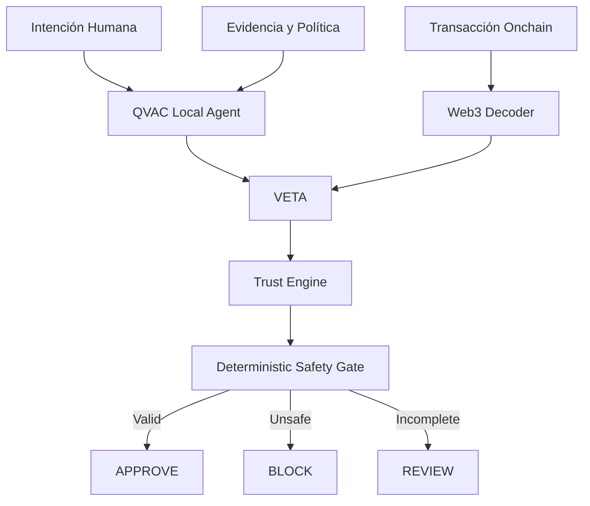

# VETA

**Verificación de Evidencia y Transacciones Autónomas**

VETA is a local-first security layer for autonomous financial operations.

It verifies that an onchain transaction is backed by trustworthy evidence before it can be approved.

> **Interpret with AI. Verify with evidence. Trust with code.**

## Core idea

Small local models can fail. VETA does **not** trust the model to authorize financial actions.

- **QVAC** interprets intent and orchestrates tools locally.
- **Viem** reads and decodes real EVM transaction data.
- **Zod** enforces structured evidence.
- A deterministic kernel validates recipient, amount, asset, policy, trust level and evidence completeness.
- Adversarial tests measure tool reliability and **unsafe approval rate**.

## Hackathon target

**QVAC Track 2 — Small models, hard tasks: tool use & reliability.**

The MVP proves one thing:

> A local model may fail, while the financial system still fails closed.
